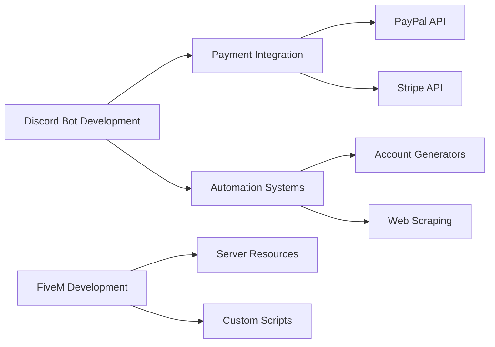

---

## 🛠️ Technology Stack

### Core Technologies

<table>
<tr>
<td align="center" width="96">

 JavaScript
</td>
<td align="center" width="96">

 TypeScript
</td>
<td align="center" width="96">

 Node.js
</td>
<td align="center" width="96">

 Python
</td>
<td align="center" width="96">

 Lua
</td>
</tr>
</table>

### Frameworks & Libraries

<table>
<tr>
<td align="center" width="96">

 Discord.js
</td>
<td align="center" width="96">

 Express
</td>
<td align="center" width="96">

 React
</td>
<td align="center" width="96">

 Next.js
</td>
<td align="center" width="96">

 Tailwind
</td>
</tr>
</table>

### Tools & Platforms

<table>
<tr>
<td align="center" width="96">

 Git
</td>
<td align="center" width="96">

 GitHub
</td>
<td align="center" width="96">

 VS Code
</td>
<td align="center" width="96">

 Docker
</td>
<td align="center" width="96">

 Figma
</td>
</tr>
</table>

### Databases & Services

<table>
<tr>
<td align="center" width="96">

 MongoDB
</td>
<td align="center" width="96">

 MySQL
</td>
<td align="center" width="96">

 Redis
</td>
<td align="center" width="96">

 Firebase
</td>
<td align="center" width="96">

 Vercel
</td>
</tr>
</table>

---

## 📊 GitHub Analytics

  
  

  

  

  

---

## 🚀 Featured Projects

### Discord Bot Ecosystem

<table>
<tr>
<td width="50%">

#### 🤖 Bot Status FiveM

Real-time FiveM server status monitoring bot with advanced Discord integration and automatic updates.

**Tech Stack:** `Discord.js` `Node.js` `FiveM API`

</td>
<td width="50%">

#### 🔐 Bot Whitelist

Automated whitelist management system for Discord servers with advanced role management and verification flows.

**Tech Stack:** `Discord.js` `Express`

</td>
</tr>
<tr>
<td width="50%">

#### 🎭 Xemotes

Custom emote system and animation framework for FiveM servers with extensive customization options.

**Tech Stack:** `Lua` `FiveM` `JavaScript`

</td>
<td width="50%">

#### 💡 More Projects
Explore my complete portfolio of open-source projects, tools, and contributions.

</td>
</tr>
</table>

---

## 🎨 Curated Collections

| Collection | Description | Link |
|------------|-------------|------|
| 🛠️ **My Stack** | Technologies and tools I work with daily |  |
| 💡 **Inspiration** | Projects and repositories that inspire me |  |
| 🚀 **Future Ideas** | Concepts and projects in the pipeline |  |

---

## 💼 Current Focus

### Active Development Areas

- **Discord Bot Architecture**: Building scalable bots with modern Discord.js v14 features including Container Components, Advanced Interactions, and Payment Systems
- **API Integration**: Implementing robust payment processing with PayPal and Stripe APIs for automated transaction handling
- **Automation Engineering**: Developing sophisticated automation tools for account generation, data scraping, and workflow optimization
- **FiveM Ecosystem**: Creating custom resources, scripts, and server monitoring solutions for GTA V multiplayer servers

---

## 📫 Get In Touch

### Let's Build Something Amazing Together

Whether you're looking to collaborate on a project, need consultation, or just want to connect, I'm always open to new opportunities.

<table>
<tr>
<td align="center">

</td>
</tr>
</table>

**Response Time:** Typically within 24-48 hours

---

### 💎 Code Quality Metrics

---

  

**⭐️ From [luckav-dev](https://github.com/luckav-dev) | Built with 💙 and ☕**

